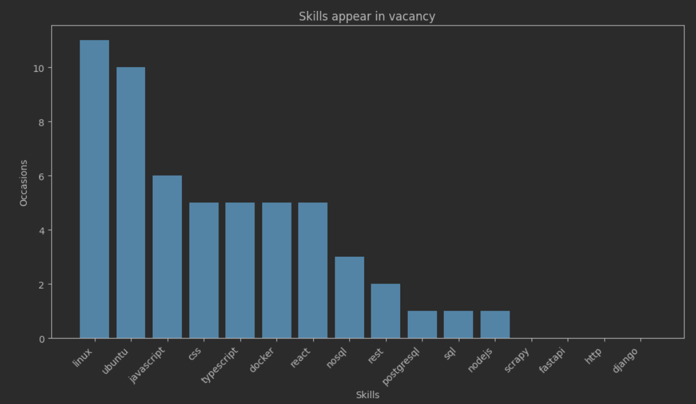

# Scraping-linkedin
Console application to show required skills in "linkedin" by country

Used technologies: Scrapy, Pandas, Jupyter, Matplotlib
# Quick setup:
- Change values in config.env, matching your needs
- Install venv and requirements(python required):
```python
git clone https://github.com/ORENYT/scraping-linkedin.git
cd scraping-linkedin
python -m venv venv
source venv/bin/activate
pip install -r requirements.txt
```
- Run spider using :
```python
scrapy crawl job_collector -o output.csv
```
- Run displayer.ipynb in data_analyse folder
# Output example:

